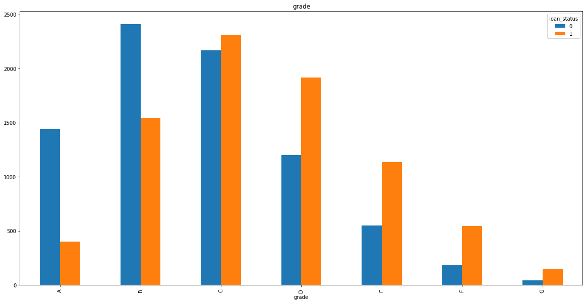
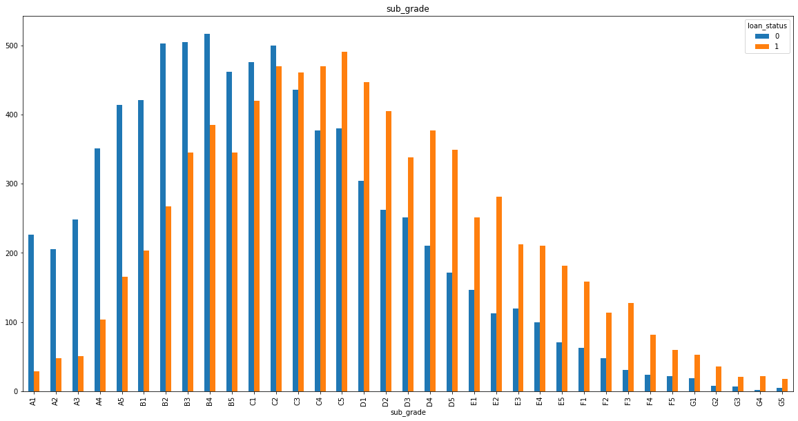
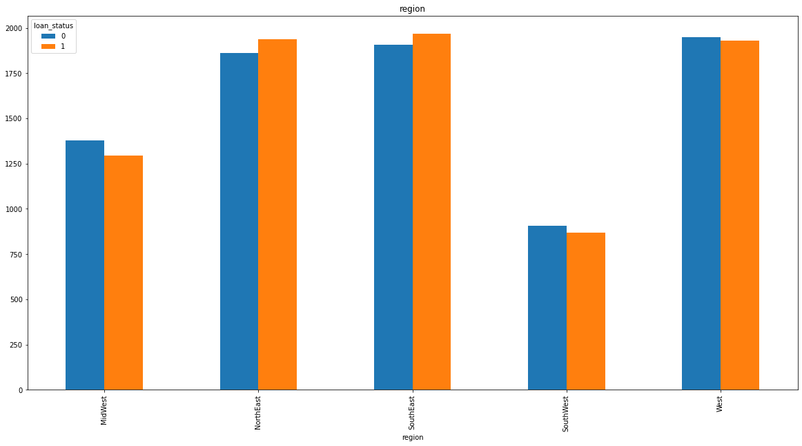
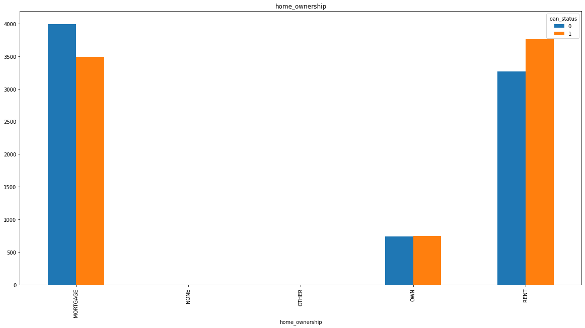
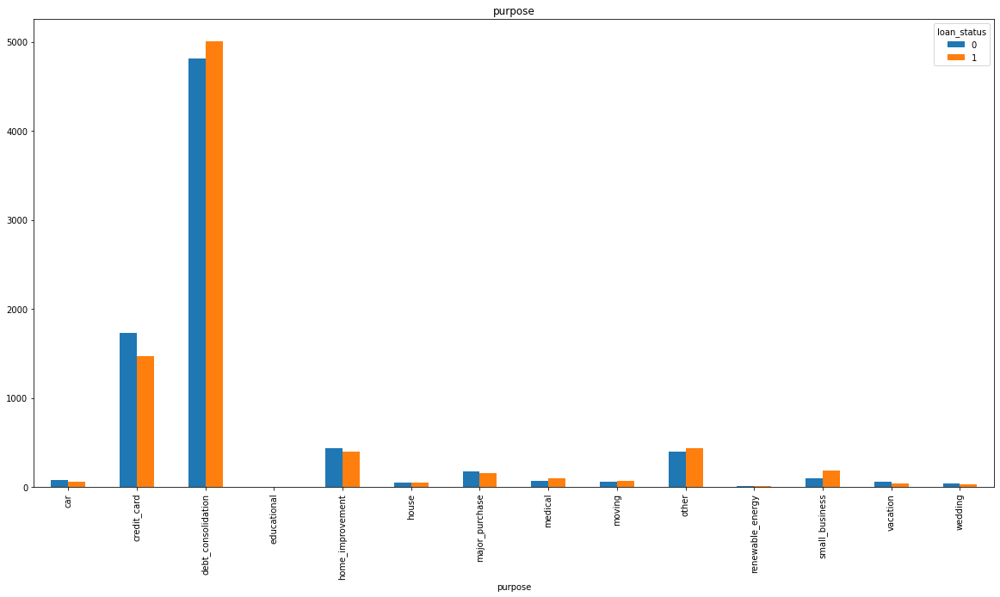
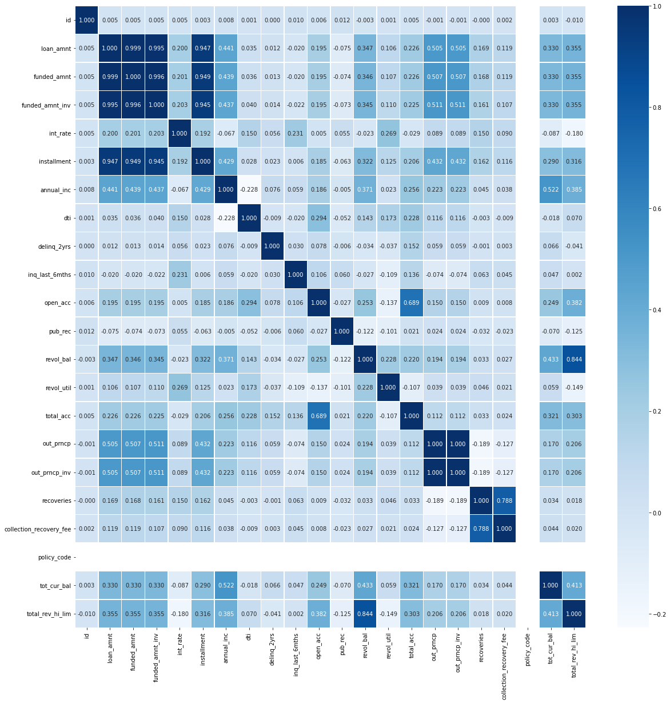

# Credit risk prediction

## 개요

2021학년도 2학기 투자공학의 과제물로 제작하여 제출한 자료로, ML 방법론을 이용하여 채무불이행을 분류 예측하는 모델을 구현하는 프로젝트입니다.

## 팀원

김진우, 박유정, 이민아

## 코드

 Forecasting model

## Import Necessary Libraries


```python
#data analysis libraries 
import numpy as np
import pandas as pd

#visualization libraries
import matplotlib.pyplot as plt
import seaborn as sns
%matplotlib inline

#ignore warnings
import warnings
warnings.filterwarnings('ignore')
```

## Read in and Explore the Data 


```python
#import train and test CSV files
train_x = pd.read_csv("/content/loan_train.csv")
train_y = pd.read_csv("/content/loan_train_label.csv")
train = pd.merge(train_x,train_y)
test = pd.read_csv("/content/loan_test.csv")
```

## Data Analysis

unique(중복되지 않는 명목형 데이터의 갯수), top(최빈값), freq(최빈값의 빈도) 등의 3개의 index는 명목형 데이터에 대해서만 사용함


```python
#see a summary of the training dataset
train.describe(include = "all")
```


<div>
<style scoped>
    .dataframe tbody tr th:only-of-type {
        vertical-align: middle;
    }

    .dataframe tbody tr th {
        vertical-align: top;
    }
    
    .dataframe thead th {
        text-align: right;
    }
</style>
<table border="1" class="dataframe">
  <thead>
    <tr style="text-align: right;">
      <th></th>
      <th>id</th>
      <th>loan_amnt</th>
      <th>funded_amnt</th>
      <th>funded_amnt_inv</th>
      <th>term</th>
      <th>int_rate</th>
      <th>installment</th>
      <th>grade</th>
      <th>sub_grade</th>
      <th>emp_title</th>
      <th>emp_length</th>
      <th>home_ownership</th>
      <th>annual_inc</th>
      <th>pymnt_plan</th>
      <th>purpose</th>
      <th>title</th>
      <th>addr_state</th>
      <th>dti</th>
      <th>delinq_2yrs</th>
      <th>earliest_cr_line</th>
      <th>inq_last_6mths</th>
      <th>open_acc</th>
      <th>pub_rec</th>
      <th>revol_bal</th>
      <th>revol_util</th>
      <th>total_acc</th>
      <th>initial_list_status</th>
      <th>out_prncp</th>
      <th>out_prncp_inv</th>
      <th>recoveries</th>
      <th>collection_recovery_fee</th>
      <th>policy_code</th>
      <th>tot_cur_bal</th>
      <th>total_rev_hi_lim</th>
      <th>loan_status</th>
    </tr>
  </thead>
  <tbody>
    <tr>
      <th>count</th>
      <td>16000.000000</td>
      <td>16000.000000</td>
      <td>16000.000000</td>
      <td>16000.000000</td>
      <td>16000</td>
      <td>16000.000000</td>
      <td>16000.000000</td>
      <td>16000</td>
      <td>16000</td>
      <td>15011</td>
      <td>15191</td>
      <td>16000</td>
      <td>16000.000000</td>
      <td>16000</td>
      <td>16000</td>
      <td>16000</td>
      <td>16000</td>
      <td>16000.000000</td>
      <td>16000.000000</td>
      <td>16000</td>
      <td>16000.000000</td>
      <td>16000.000000</td>
      <td>16000.000000</td>
      <td>16000.000000</td>
      <td>15991.000000</td>
      <td>16000.000000</td>
      <td>16000</td>
      <td>16000.000000</td>
      <td>16000.000000</td>
      <td>16000.000000</td>
      <td>16000.000000</td>
      <td>16000.0</td>
      <td>1.400400e+04</td>
      <td>1.400400e+04</td>
      <td>16000.000000</td>
    </tr>
    <tr>
      <th>unique</th>
      <td>NaN</td>
      <td>NaN</td>
      <td>NaN</td>
      <td>NaN</td>
      <td>2</td>
      <td>NaN</td>
      <td>NaN</td>
      <td>7</td>
      <td>35</td>
      <td>10412</td>
      <td>11</td>
      <td>5</td>
      <td>NaN</td>
      <td>2</td>
      <td>14</td>
      <td>2830</td>
      <td>49</td>
      <td>NaN</td>
      <td>NaN</td>
      <td>527</td>
      <td>NaN</td>
      <td>NaN</td>
      <td>NaN</td>
      <td>NaN</td>
      <td>NaN</td>
      <td>NaN</td>
      <td>2</td>
      <td>NaN</td>
      <td>NaN</td>
      <td>NaN</td>
      <td>NaN</td>
      <td>NaN</td>
      <td>NaN</td>
      <td>NaN</td>
      <td>NaN</td>
    </tr>
    <tr>
      <th>top</th>
      <td>NaN</td>
      <td>NaN</td>
      <td>NaN</td>
      <td>NaN</td>
      <td>36 months</td>
      <td>NaN</td>
      <td>NaN</td>
      <td>C</td>
      <td>C2</td>
      <td>Manager</td>
      <td>10+ years</td>
      <td>MORTGAGE</td>
      <td>NaN</td>
      <td>n</td>
      <td>debt_consolidation</td>
      <td>Debt consolidation</td>
      <td>CA</td>
      <td>NaN</td>
      <td>NaN</td>
      <td>Aug-2001</td>
      <td>NaN</td>
      <td>NaN</td>
      <td>NaN</td>
      <td>NaN</td>
      <td>NaN</td>
      <td>NaN</td>
      <td>f</td>
      <td>NaN</td>
      <td>NaN</td>
      <td>NaN</td>
      <td>NaN</td>
      <td>NaN</td>
      <td>NaN</td>
      <td>NaN</td>
      <td>NaN</td>
    </tr>
    <tr>
      <th>freq</th>
      <td>NaN</td>
      <td>NaN</td>
      <td>NaN</td>
      <td>NaN</td>
      <td>10895</td>
      <td>NaN</td>
      <td>NaN</td>
      <td>4481</td>
      <td>970</td>
      <td>179</td>
      <td>4947</td>
      <td>7481</td>
      <td>NaN</td>
      <td>15998</td>
      <td>9821</td>
      <td>6730</td>
      <td>2464</td>
      <td>NaN</td>
      <td>NaN</td>
      <td>133</td>
      <td>NaN</td>
      <td>NaN</td>
      <td>NaN</td>
      <td>NaN</td>
      <td>NaN</td>
      <td>NaN</td>
      <td>9691</td>
      <td>NaN</td>
      <td>NaN</td>
      <td>NaN</td>
      <td>NaN</td>
      <td>NaN</td>
      <td>NaN</td>
      <td>NaN</td>
      <td>NaN</td>
    </tr>
    <tr>
      <th>mean</th>
      <td>8000.500000</td>
      <td>14691.871875</td>
      <td>14671.512500</td>
      <td>14611.220088</td>
      <td>NaN</td>
      <td>14.552899</td>
      <td>441.047334</td>
      <td>NaN</td>
      <td>NaN</td>
      <td>NaN</td>
      <td>NaN</td>
      <td>NaN</td>
      <td>71059.510253</td>
      <td>NaN</td>
      <td>NaN</td>
      <td>NaN</td>
      <td>NaN</td>
      <td>18.217242</td>
      <td>0.306750</td>
      <td>NaN</td>
      <td>0.816875</td>
      <td>11.353687</td>
      <td>0.177875</td>
      <td>15662.826750</td>
      <td>56.857532</td>
      <td>24.989250</td>
      <td>NaN</td>
      <td>5888.974696</td>
      <td>5886.719976</td>
      <td>217.279625</td>
      <td>23.840330</td>
      <td>1.0</td>
      <td>1.301645e+05</td>
      <td>2.913961e+04</td>
      <td>0.500000</td>
    </tr>
    <tr>
      <th>std</th>
      <td>4618.946489</td>
      <td>8429.444658</td>
      <td>8421.274518</td>
      <td>8435.308937</td>
      <td>NaN</td>
      <td>4.536686</td>
      <td>246.142880</td>
      <td>NaN</td>
      <td>NaN</td>
      <td>NaN</td>
      <td>NaN</td>
      <td>NaN</td>
      <td>44610.863478</td>
      <td>NaN</td>
      <td>NaN</td>
      <td>NaN</td>
      <td>NaN</td>
      <td>8.241161</td>
      <td>0.868448</td>
      <td>NaN</td>
      <td>1.058258</td>
      <td>5.120252</td>
      <td>0.494849</td>
      <td>18030.810965</td>
      <td>23.742279</td>
      <td>11.796682</td>
      <td>NaN</td>
      <td>8062.958881</td>
      <td>8059.825159</td>
      <td>840.290799</td>
      <td>137.546283</td>
      <td>0.0</td>
      <td>1.434553e+05</td>
      <td>2.855900e+04</td>
      <td>0.500016</td>
    </tr>
    <tr>
      <th>min</th>
      <td>1.000000</td>
      <td>1000.000000</td>
      <td>1000.000000</td>
      <td>0.000000</td>
      <td>NaN</td>
      <td>5.320000</td>
      <td>24.320000</td>
      <td>NaN</td>
      <td>NaN</td>
      <td>NaN</td>
      <td>NaN</td>
      <td>NaN</td>
      <td>4524.000000</td>
      <td>NaN</td>
      <td>NaN</td>
      <td>NaN</td>
      <td>NaN</td>
      <td>0.000000</td>
      <td>0.000000</td>
      <td>NaN</td>
      <td>0.000000</td>
      <td>1.000000</td>
      <td>0.000000</td>
      <td>0.000000</td>
      <td>0.000000</td>
      <td>2.000000</td>
      <td>NaN</td>
      <td>0.000000</td>
      <td>0.000000</td>
      <td>0.000000</td>
      <td>0.000000</td>
      <td>1.0</td>
      <td>0.000000e+00</td>
      <td>0.000000e+00</td>
      <td>0.000000</td>
    </tr>
    <tr>
      <th>25%</th>
      <td>4000.750000</td>
      <td>8000.000000</td>
      <td>8000.000000</td>
      <td>8000.000000</td>
      <td>NaN</td>
      <td>11.530000</td>
      <td>264.460000</td>
      <td>NaN</td>
      <td>NaN</td>
      <td>NaN</td>
      <td>NaN</td>
      <td>NaN</td>
      <td>44000.000000</td>
      <td>NaN</td>
      <td>NaN</td>
      <td>NaN</td>
      <td>NaN</td>
      <td>12.110000</td>
      <td>0.000000</td>
      <td>NaN</td>
      <td>0.000000</td>
      <td>8.000000</td>
      <td>0.000000</td>
      <td>6227.500000</td>
      <td>39.800000</td>
      <td>16.000000</td>
      <td>NaN</td>
      <td>0.000000</td>
      <td>0.000000</td>
      <td>0.000000</td>
      <td>0.000000</td>
      <td>1.0</td>
      <td>2.874075e+04</td>
      <td>1.310000e+04</td>
      <td>0.000000</td>
    </tr>
    <tr>
      <th>50%</th>
      <td>8000.500000</td>
      <td>12800.000000</td>
      <td>12700.000000</td>
      <td>12600.000000</td>
      <td>NaN</td>
      <td>14.310000</td>
      <td>386.755000</td>
      <td>NaN</td>
      <td>NaN</td>
      <td>NaN</td>
      <td>NaN</td>
      <td>NaN</td>
      <td>60000.000000</td>
      <td>NaN</td>
      <td>NaN</td>
      <td>NaN</td>
      <td>NaN</td>
      <td>17.850000</td>
      <td>0.000000</td>
      <td>NaN</td>
      <td>0.000000</td>
      <td>11.000000</td>
      <td>0.000000</td>
      <td>11472.500000</td>
      <td>58.500000</td>
      <td>23.000000</td>
      <td>NaN</td>
      <td>0.000000</td>
      <td>0.000000</td>
      <td>0.000000</td>
      <td>0.000000</td>
      <td>1.0</td>
      <td>7.011400e+04</td>
      <td>2.200000e+04</td>
      <td>0.500000</td>
    </tr>
    <tr>
      <th>75%</th>
      <td>12000.250000</td>
      <td>20000.000000</td>
      <td>20000.000000</td>
      <td>20000.000000</td>
      <td>NaN</td>
      <td>17.570000</td>
      <td>576.532500</td>
      <td>NaN</td>
      <td>NaN</td>
      <td>NaN</td>
      <td>NaN</td>
      <td>NaN</td>
      <td>85000.000000</td>
      <td>NaN</td>
      <td>NaN</td>
      <td>NaN</td>
      <td>NaN</td>
      <td>23.930000</td>
      <td>0.000000</td>
      <td>NaN</td>
      <td>1.000000</td>
      <td>14.000000</td>
      <td>0.000000</td>
      <td>19849.000000</td>
      <td>75.200000</td>
      <td>32.000000</td>
      <td>NaN</td>
      <td>10263.235000</td>
      <td>10261.097500</td>
      <td>0.000000</td>
      <td>0.000000</td>
      <td>1.0</td>
      <td>1.961705e+05</td>
      <td>3.660000e+04</td>
      <td>1.000000</td>
    </tr>
    <tr>
      <th>max</th>
      <td>16000.000000</td>
      <td>35000.000000</td>
      <td>35000.000000</td>
      <td>35000.000000</td>
      <td>NaN</td>
      <td>28.990000</td>
      <td>1374.630000</td>
      <td>NaN</td>
      <td>NaN</td>
      <td>NaN</td>
      <td>NaN</td>
      <td>NaN</td>
      <td>950000.000000</td>
      <td>NaN</td>
      <td>NaN</td>
      <td>NaN</td>
      <td>NaN</td>
      <td>120.660000</td>
      <td>20.000000</td>
      <td>NaN</td>
      <td>8.000000</td>
      <td>52.000000</td>
      <td>8.000000</td>
      <td>867528.000000</td>
      <td>148.000000</td>
      <td>91.000000</td>
      <td>NaN</td>
      <td>35000.000000</td>
      <td>35000.000000</td>
      <td>24862.100000</td>
      <td>6543.040000</td>
      <td>1.0</td>
      <td>1.969261e+06</td>
      <td>1.035000e+06</td>
      <td>1.000000</td>
    </tr>
  </tbody>
</table>
</div>


```python
#결측값 확인
print(pd.isnull(train).sum())
```

    id                            0
    loan_amnt                     0
    funded_amnt                   0
    funded_amnt_inv               0
    term                          0
    int_rate                      0
    installment                   0
    grade                         0
    sub_grade                     0
    emp_title                   989
    emp_length                  809
    home_ownership                0
    annual_inc                    0
    pymnt_plan                    0
    purpose                       0
    title                         0
    addr_state                    0
    dti                           0
    delinq_2yrs                   0
    earliest_cr_line              0
    inq_last_6mths                0
    open_acc                      0
    pub_rec                       0
    revol_bal                     0
    revol_util                    9
    total_acc                     0
    initial_list_status           0
    out_prncp                     0
    out_prncp_inv                 0
    recoveries                    0
    collection_recovery_fee       0
    policy_code                   0
    tot_cur_bal                1996
    total_rev_hi_lim           1996
    loan_status                   0
    dtype: int64


```python
#결측치 ratio 구하기(missingdata_df)
missing_df = train.isnull().sum().reset_index()
missing_df.columns = ['column', 'count']
missing_df['ratio'] = missing_df['count']/train.shape[0]
missingdata_df = missing_df.loc[missing_df['ratio'] != 0]
print(missingdata_df)
```

                  column  count     ratio
    9          emp_title    989  0.061812
    10        emp_length    809  0.050563
    24        revol_util      9  0.000562
    32       tot_cur_bal   1996  0.124750
    33  total_rev_hi_lim   1996  0.124750


## 데이터 시각화

### grade/subgrade


```python
## grade
grade_df = train.groupby(['grade','loan_status'])['loan_status'].count().unstack('loan_status')
grade_df.plot(kind='bar', figsize=(20,10))
plt.title('grade')
plt.show()
```


​    

​    


```python
## subgrade
subgrade_df = train.groupby(['sub_grade','loan_status'])['loan_status'].count().unstack('loan_status')
subgrade_df.plot(kind='bar', figsize=(20,10))
plt.title('sub_grade')
plt.show()
```


​    

​    


### addr_state


```python
train['addr_state'].unique()

west = ['CA', 'OR', 'UT','WA', 'CO', 'NV', 'AK', 'MT', 'HI', 'WY', 'ID']
south_west = ['AZ', 'TX', 'NM', 'OK']
south_east = ['GA', 'NC', 'VA', 'FL', 'KY', 'SC', 'LA', 'AL', 'WV', 'DC', 'AR', 'DE', 'MS', 'TN' ]
mid_west = ['IL', 'MO', 'MN', 'OH', 'WI', 'KS', 'MI', 'SD', 'IA', 'NE', 'IN', 'ND']
north_east = ['CT', 'NY', 'PA', 'NJ', 'RI','MA', 'MD', 'VT', 'NH', 'ME']

train['region'] = np.nan

def finding_regions(state):
    if state in west:
        return 'West'
    elif state in south_west:
        return 'SouthWest'
    elif state in south_east:
        return 'SouthEast'
    elif state in mid_west:
        return 'MidWest'
    elif state in north_east:
        return 'NorthEast'

train['region'] = train['addr_state'].apply(finding_regions)

region_df = train.groupby(['region','loan_status'])['loan_status'].count().unstack('loan_status')
region_df.plot(kind='bar', figsize=(20,10))
plt.title('region')
plt.show()
```


​    

​    


지역 별 채무불이행 비율 차이가 크지 않기 때문에 무시한다

### home_ownership


```python
region_df = train.groupby(['home_ownership','loan_status'])['loan_status'].count().unstack('loan_status')
region_df.plot(kind='bar', figsize=(20,10))
plt.title('home_ownership')
plt.show()
```


​    

​    


유의미한 차이를 보이는 MORTGAGE, RENT만 활용

### purpose


```python
region_df = train.groupby(['purpose','loan_status'])['loan_status'].count().unstack('loan_status')
region_df.plot(kind='bar', figsize=(20,10))
plt.title('purpose')
plt.show()
```


​    


​    


유의미한 차이를 보이는 credit_card만 활용

## 데이터 축소

### 의미없는 데이터 삭제

##### grade


```python
## 데이터 중복 --> 제외
train = train.drop(['grade'], axis = 1)
test = test.drop(['grade'], axis = 1)
```

##### emp_title


```python
## 데이터가 매우 다양 --> 제외

train = train.drop(['emp_title'], axis = 1)
test = test.drop(['emp_title'], axis = 1)
```

##### pymnt_plan


```python
## y가 전체에서 2개 --> 제외

train = train.drop(['pymnt_plan'], axis = 1)
test = test.drop(['pymnt_plan'], axis = 1)
```

##### title


```python
## 데이터가 매우 다양한 형태 --> 제외

train = train.drop(['title'], axis = 1)
test = test.drop(['title'], axis = 1)
```

##### addr_state


```python
## 의미없음 --> 제외

train = train.drop(['addr_state'], axis = 1)
test = test.drop(['addr_state'], axis = 1)
train = train.drop(['region'], axis = 1)
```

##### policy_code


```python
## 의미없음 --> 제외

train = train.drop(['policy_code'], axis = 1)
test = test.drop(['policy_code'], axis = 1)

```

### 데이터 상관관계

#### 상관관계 확인


```python
plt.figure(figsize=(20,20))
sns.heatmap(data=train_x.corr(), annot=True, fmt='.3f',linewidths=.4,cmap='Blues')
```


    <matplotlib.axes._subplots.AxesSubplot at 0x7f6d150ed3d0>


​    

​    


#### 상관관계 높은 데이터 삭제

##### out_prncp_inv


```python
train = train.drop(['out_prncp_inv'], axis = 1)
test = test.drop(['out_prncp_inv'], axis = 1)
```

##### collection_recovery_fee


```python
train = train.drop(['collection_recovery_fee'], axis = 1)
test = test.drop(['collection_recovery_fee'], axis = 1)
```

#### 주성분 분석을 이용한 데이터 축소
loan_amnt, funded_amnt, funded_amnt_inv, installment


```python
## train
from sklearn.preprocessing import StandardScaler
x = train[['loan_amnt','funded_amnt','funded_amnt_inv','installment']].values
x = StandardScaler().fit_transform(x)  #x객체에 x를 표준화한 데이터를 저장
from sklearn.decomposition import PCA
pca = PCA(n_components=1)
principalComponents_train = pca.fit_transform(x)
train['new_loan_amnt'] = principalComponents_train
print(pca.explained_variance_ratio_)
```

    [0.97902809]


```python
## test
from sklearn.preprocessing import StandardScaler
x = test[['loan_amnt','funded_amnt','funded_amnt_inv','installment']].values
x = StandardScaler().fit_transform(x)  #x객체에 x를 표준화한 데이터를 저장
from sklearn.decomposition import PCA
pca = PCA(n_components=1)
principalComponents_test = pca.fit_transform(x)
test['new_loan_amnt'] = principalComponents_test
print(pca.explained_variance_ratio_)
```

    [0.97901001]


```python
train = train.drop(['loan_amnt','funded_amnt','funded_amnt_inv','installment'],axis=1)
test = test.drop(['loan_amnt','funded_amnt','funded_amnt_inv','installment'],axis=1)
```

## Alphanumeric 데이터 & 문자 데이터

#### term


```python
# month 제거 필요
for i in range(0,len(train["term"])):
  train["term"][i] = int(train["term"][i][:3])
for i in range(0,len(test["term"])):
  test["term"][i] = int(test["term"][i][:3])
```

#### sub_grade


```python
# 숫자형으로 변환
# train
for i in range(0,len(train["sub_grade"])):

  if train["sub_grade"][i][:1] == "A":
    first = 0
  elif train["sub_grade"][i][:1] == "B":
    first = 5
  elif train["sub_grade"][i][:1] == "C":
    first = 10
  elif train["sub_grade"][i][:1] == "D":
    first = 15
  elif train["sub_grade"][i][:1] == "E":
    first = 20
  elif train["sub_grade"][i][:1] == "F":
    first = 25
  elif train["sub_grade"][i][:1] == "G":
    first = 30
    
  train["sub_grade"][i] = first
```


```python
# test
for i in range(0,len(test["sub_grade"])):

  if test["sub_grade"][i][:1] == "A":
    first = 0
  elif test["sub_grade"][i][:1] == "B":
    first = 5
  elif test["sub_grade"][i][:1] == "C":
    first = 10
  elif test["sub_grade"][i][:1] == "D":
    first = 15
  elif test["sub_grade"][i][:1] == "E":
    first = 20
  elif test["sub_grade"][i][:1] == "F":
    first = 25
  elif test["sub_grade"][i][:1] == "G":
    first = 30
    
  test["sub_grade"][i] = first
```

### emp_length


```python
# 숫자형으로 변환
# train
for i in range(0,len(train["emp_length"])):

  if train["emp_length"][i] == "< 1 year":
    length = 0
  elif train["emp_length"][i] == "1 year":
    length = 1
  elif train["emp_length"][i] == "2 years":
    length = 2
  elif train["emp_length"][i] == "3 years":
    length = 3
  elif train["emp_length"][i] == "4 years":
    length = 4
  elif train["emp_length"][i] == "5 years":
    length = 5
  elif train["emp_length"][i] == "6 years":
    length = 6
  elif train["emp_length"][i] == "7 years":
    length = 7
  elif train["emp_length"][i] == "8 years":
    length = 8
  elif train["emp_length"][i] == "9 years":
    length = 9
  elif train["emp_length"][i] == "10+ years":
    length = 10

  train["emp_length"][i] = length
```


```python
# test
for i in range(0,len(test["emp_length"])):

  if test["emp_length"][i] == "< 1 year":
    length = 0
  elif test["emp_length"][i] == "1 year":
    length = 1
  elif test["emp_length"][i] == "2 years":
    length = 2
  elif test["emp_length"][i] == "3 years":
    length = 3
  elif test["emp_length"][i] == "4 years":
    length = 4
  elif test["emp_length"][i] == "5 years":
    length = 5
  elif test["emp_length"][i] == "6 years":
    length = 6
  elif test["emp_length"][i] == "7 years":
    length = 7
  elif test["emp_length"][i] == "8 years":
    length = 8
  elif test["emp_length"][i] == "9 years":
    length = 9
  elif test["emp_length"][i] == "10+ years":
    length = 10

  test["emp_length"][i] = length
```

## 범주형 데이터

### home_ownership


```python
# 더미변수화
home_ownership_dummies_train = pd.get_dummies(train["home_ownership"])
home_ownership_dummies_test = pd.get_dummies(test["home_ownership"])
# MORTGAGE와 RENT 유무만 판단
home_ownership_dummies_train = home_ownership_dummies_train.drop(['NONE','OTHER','OWN'], axis = 1)
train = pd.concat([train,home_ownership_dummies_train],axis=1)
home_ownership_dummies_test = home_ownership_dummies_test.drop(['OTHER','OWN'], axis = 1)
test = pd.concat([test,home_ownership_dummies_test],axis=1)

train = train.drop(['home_ownership'], axis = 1)
test = test.drop(['home_ownership'], axis = 1)
```

### purpose


```python
# 더미변수화
purpose_dummies_train = pd.get_dummies(train["purpose"])
purpose_dummies_test = pd.get_dummies(test["purpose"])
# MORTGAGE와 RENT 유무만 판단
purpose_dummies_train = purpose_dummies_train.drop(['car', 'debt_consolidation', 'educational',
       'home_improvement', 'house', 'major_purchase', 'medical', 'moving',
       'other', 'renewable_energy', 'small_business', 'vacation', 'wedding'], axis = 1)
train = pd.concat([train,purpose_dummies_train],axis=1)
purpose_dummies_test = purpose_dummies_test.drop(['car','debt_consolidation', 'educational',
       'home_improvement', 'house', 'major_purchase', 'medical', 'moving',
       'other', 'renewable_energy', 'small_business', 'vacation', 'wedding'], axis = 1)
test = pd.concat([test,purpose_dummies_test],axis=1)

train = train.drop(['purpose'], axis = 1)
test = test.drop(['purpose'], axis = 1)
```

### initial_list_status


```python
# 0 or 1로 맵핑
initial_list_status_mapping = {"w": 0, "f": 1}
train['initial_list_status'] = train['initial_list_status'].map(initial_list_status_mapping)
test['initial_list_status'] = test['initial_list_status'].map(initial_list_status_mapping)

train.head()
```


<div>
<style scoped>
    .dataframe tbody tr th:only-of-type {
        vertical-align: middle;
    }

    .dataframe tbody tr th {
        vertical-align: top;
    }
    
    .dataframe thead th {
        text-align: right;
    }
</style>
<table border="1" class="dataframe">
  <thead>
    <tr style="text-align: right;">
      <th></th>
      <th>id</th>
      <th>term</th>
      <th>int_rate</th>
      <th>sub_grade</th>
      <th>emp_length</th>
      <th>annual_inc</th>
      <th>dti</th>
      <th>delinq_2yrs</th>
      <th>earliest_cr_line</th>
      <th>inq_last_6mths</th>
      <th>open_acc</th>
      <th>pub_rec</th>
      <th>revol_bal</th>
      <th>revol_util</th>
      <th>total_acc</th>
      <th>initial_list_status</th>
      <th>out_prncp</th>
      <th>recoveries</th>
      <th>tot_cur_bal</th>
      <th>total_rev_hi_lim</th>
      <th>loan_status</th>
      <th>new_loan_amnt</th>
      <th>MORTGAGE</th>
      <th>RENT</th>
      <th>credit_card</th>
    </tr>
  </thead>
  <tbody>
    <tr>
      <th>0</th>
      <td>1</td>
      <td>60</td>
      <td>19.99</td>
      <td>20</td>
      <td>2</td>
      <td>46900.0</td>
      <td>21.08</td>
      <td>0</td>
      <td>Jan-2010</td>
      <td>2</td>
      <td>10</td>
      <td>0</td>
      <td>11736</td>
      <td>39.3</td>
      <td>17</td>
      <td>0</td>
      <td>14401.39</td>
      <td>0.0</td>
      <td>43804.0</td>
      <td>29900.0</td>
      <td>0</td>
      <td>-0.025863</td>
      <td>0</td>
      <td>1</td>
      <td>0</td>
    </tr>
    <tr>
      <th>1</th>
      <td>2</td>
      <td>36</td>
      <td>18.99</td>
      <td>20</td>
      <td>10</td>
      <td>80000.0</td>
      <td>22.71</td>
      <td>0</td>
      <td>Nov-1994</td>
      <td>0</td>
      <td>10</td>
      <td>0</td>
      <td>40950</td>
      <td>97.7</td>
      <td>29</td>
      <td>0</td>
      <td>11947.70</td>
      <td>0.0</td>
      <td>50777.0</td>
      <td>41900.0</td>
      <td>0</td>
      <td>1.538320</td>
      <td>0</td>
      <td>1</td>
      <td>0</td>
    </tr>
    <tr>
      <th>2</th>
      <td>3</td>
      <td>60</td>
      <td>16.99</td>
      <td>15</td>
      <td>10</td>
      <td>55000.0</td>
      <td>15.03</td>
      <td>0</td>
      <td>Sep-2000</td>
      <td>0</td>
      <td>10</td>
      <td>1</td>
      <td>1759</td>
      <td>12.0</td>
      <td>25</td>
      <td>0</td>
      <td>9101.23</td>
      <td>0.0</td>
      <td>149114.0</td>
      <td>14700.0</td>
      <td>0</td>
      <td>-1.217898</td>
      <td>1</td>
      <td>0</td>
      <td>0</td>
    </tr>
    <tr>
      <th>3</th>
      <td>4</td>
      <td>36</td>
      <td>15.31</td>
      <td>10</td>
      <td>2</td>
      <td>40000.0</td>
      <td>14.52</td>
      <td>0</td>
      <td>Aug-2005</td>
      <td>0</td>
      <td>10</td>
      <td>0</td>
      <td>8996</td>
      <td>84.1</td>
      <td>14</td>
      <td>1</td>
      <td>0.00</td>
      <td>0.0</td>
      <td>75043.0</td>
      <td>10700.0</td>
      <td>0</td>
      <td>-0.522405</td>
      <td>0</td>
      <td>0</td>
      <td>1</td>
    </tr>
    <tr>
      <th>4</th>
      <td>5</td>
      <td>36</td>
      <td>9.99</td>
      <td>5</td>
      <td>10</td>
      <td>85000.0</td>
      <td>13.24</td>
      <td>1</td>
      <td>Mar-1993</td>
      <td>0</td>
      <td>8</td>
      <td>0</td>
      <td>7974</td>
      <td>47.5</td>
      <td>29</td>
      <td>0</td>
      <td>0.00</td>
      <td>0.0</td>
      <td>259060.0</td>
      <td>16800.0</td>
      <td>0</td>
      <td>1.363500</td>
      <td>0</td>
      <td>0</td>
      <td>0</td>
    </tr>
  </tbody>
</table>
</div>


## 날짜 데이터

### earliest_cr_line


```python
import datetime
today = datetime.datetime.today()

## train
for i in range(0,len(train["earliest_cr_line"])):
  num_train = today - datetime.datetime.strptime(train["earliest_cr_line"][i],'%b-%Y')
  num_train = num_train.days

  train["earliest_cr_line"][i] = num_train
```


```python
# test
for i in range(0,len(test["earliest_cr_line"])):
  num_test = today - datetime.datetime.strptime(test["earliest_cr_line"][i],'%b-%Y')
  num_test = num_test.days

  test["earliest_cr_line"][i] = num_test
```

##결측치 제거

### emp_length


```python
 for i in range(0,len(train["emp_length"])):
  #결측값처리 -> 최빈값 10 입력
  if pd.isnull(train["emp_length"][i]) == True:
    length = 10
    train["emp_length"][i] = length
```

### revol_util


```python
train = train.fillna(train.mean()['revol_util'])
test = test.fillna(test.mean()['revol_util'])
```

### tot_cur_bal : total_rev_hi_lim


```python
train = train.fillna(train.mean()['tot_cur_bal':'total_rev_hi_lim'])
test = test.fillna(test.mean()['tot_cur_bal':'total_rev_hi_lim'])
```

## 이상치 제거


```python
def outlier(data, rate=1.5):
    q1 = np.quantile(data, q=0.25)
    q3 = np.quantile(data, q=0.75)
    IQR = q3 - q1
    return (data > q1-IQR * rate) & (data < q3+IQR * rate)
```


```python
def outlier_recoveries(data, rate=1.5):
    q1 = np.quantile(data, q=0.25)
    q3 = np.quantile(data, q=0.95)
    IQR = q3 - q1
    return (data > q1-IQR * rate) & (data < q3+IQR * rate)
```


```python
# 연속형 변수 - recoveries는 0값이 3사분위(0.75)이상 차지하고 있어 따로 처리
for i in ['int_rate','annual_inc','dti', 'earliest_cr_line', 'revol_bal', 'revol_util', 'total_acc',
       'out_prncp', 'tot_cur_bal','total_rev_hi_lim', 'new_loan_amnt']:

       max_train = np.max(train[i][outlier(train[i])])
       train.loc[train[i]>max_train, i] = max_train

       max_test = np.max(test[i][outlier(test[i])])
       test.loc[test[i]>max_test, i] = max_test

#recoveries 0.95이상에 대해 처리 & rate = 3
i = "recoveries"
max_train = np.max(train[i][outlier_recoveries(train[i])])
train.loc[train[i]>max_train, i] = max_train

max_test = np.max(test[i][outlier_recoveries(test[i])])
test.loc[test[i]>max_test, i] = max_test
```

## Model

### M1 : Logistic regression - Normal version

Splitting the Training Data

다른 모델에서의 정확도를 테스트하기 위해 training data에서 일부(30%)를 떼어낼 것 -> Train과 val로 구분 7:3


```python
from sklearn.model_selection import train_test_split

predictors = train.drop(['loan_status', 'id'], axis=1)
target = train["loan_status"]
x_train, x_val, y_train, y_val = train_test_split(predictors, target, test_size = 0.3, random_state = 0)
```


```python
from sklearn.model_selection import train_test_split
from sklearn.linear_model import LogisticRegression
from sklearn.metrics import accuracy_score

logreg = LogisticRegression()
logreg.fit(x_train, y_train)
y_pred = logreg.predict(x_val)
acc_M1 = round(accuracy_score(y_pred, y_val)*100,2)

print(acc_M1)
```

    66.56


###  M2 : Logistic regression - Stepwise Method version

변수선정


```python
!pip install mord dmba
```

    Collecting mord
      Downloading mord-0.6.tar.gz (4.7 kB)
    Collecting dmba
      Downloading dmba-0.0.18-py3-none-any.whl (11.8 MB)
    [K     |████████████████████████████████| 11.8 MB 205 kB/s 
    [?25hBuilding wheels for collected packages: mord
      Building wheel for mord (setup.py) ... [?25l[?25hdone
      Created wheel for mord: filename=mord-0.6-py3-none-any.whl size=6006 sha256=ed6ce2045b825c4b08202e70a67c05b039a0878e5db97edd42eb88eba678bf7c
      Stored in directory: /root/.cache/pip/wheels/80/1d/8a/bef1a01b6a3c91494905d161d5426c181819f9730a773141eb
    Successfully built mord
    Installing collected packages: mord, dmba
    Successfully installed dmba-0.0.18 mord-0.6


```python
from dmba import backward_elimination, forward_selection, stepwise_selection
from sklearn.metrics import accuracy_score
%matplotlib inline

from pathlib import Path

import numpy as np
import pandas as pd
from sklearn.linear_model import LogisticRegression, LogisticRegressionCV
from sklearn.model_selection import train_test_split
import statsmodels.api as sm
import matplotlib.pylab as plt
import seaborn as sns

def train_model(variables):
    if len(variables) == 0:
        return None
    model = LogisticRegressionCV(penalty="l2", solver='liblinear', cv=5)

    model.fit(predictors[list(variables)], target)
    return model

def score_model(model, variables):
    if len(variables) == 0:
        return 0
    target_pred = model.predict(predictors[list(variables)])
    # we negate as score is optimized to be as low as possible
    return -accuracy_score(target, target_pred)

allVariables = predictors.columns
best_fitting, var_fitting = stepwise_selection(allVariables, train_model, 
                                score_model, verbose=True)
print(sorted(var_fitting))
```

    no display found. Using non-interactive Agg backend
    Variables: term, int_rate, sub_grade, emp_length, annual_inc, dti, delinq_2yrs, earliest_cr_line, inq_last_6mths, open_acc, pub_rec, revol_bal, revol_util, total_acc, initial_list_status, out_prncp, recoveries, tot_cur_bal, total_rev_hi_lim, new_loan_amnt, MORTGAGE, RENT, credit_card
    Start: score=0.00, constant
    Step: score=-0.63, add recoveries
    Step: score=-0.68, add sub_grade
    Step: score=-0.69, add out_prncp
    Step: score=-0.69, add pub_rec
    Step: score=-0.69, unchanged None
    ['out_prncp', 'pub_rec', 'recoveries', 'sub_grade']


Forecasting


```python
predictors = predictors.drop(['term', 'int_rate', 'emp_length', 'annual_inc', 'dti',
       'delinq_2yrs', 'earliest_cr_line', 'inq_last_6mths', 'open_acc',
       'revol_bal', 'revol_util', 'total_acc',
       'initial_list_status','tot_cur_bal',
       'total_rev_hi_lim', 'new_loan_amnt', 'MORTGAGE', 'RENT', 'credit_card'], axis=1)
target = train["loan_status"]
x_train, x_val, y_train, y_val = train_test_split(predictors, target, test_size = 0.3, random_state = 0)
```


```python
from sklearn.linear_model import LogisticRegression


x_train, x_val, y_train, y_val = train_test_split(predictors, target, test_size = 0.3, random_state = 0)

logreg = LogisticRegression()
logreg.fit(x_train, y_train)
y_pred = logreg.predict(x_val)
acc_M2 = round(accuracy_score(y_pred, y_val) * 100, 2)
print(acc_M2)
```

    69.65


### M3 : Decision Tree(CART)


```python
predictors = train.drop(['loan_status', 'id'], axis=1)
target = train["loan_status"]
x_train, x_val, y_train, y_val = train_test_split(predictors, target, test_size = 0.3, random_state = 0)
```


```python
from sklearn.tree import DecisionTreeClassifier

decisiontree = DecisionTreeClassifier(criterion="entropy")
decisiontree.fit(x_train, y_train)
y_pred = decisiontree.predict(x_val)
acc_M3 = round(accuracy_score(y_pred, y_val) * 100, 2)
print(acc_M3)
```

    64.02


### M4 : Decision Tree(CART) & avoiding overfitting problem (Using tree growth stopping rules)


```python
predictors = train.drop(['loan_status', 'id'], axis=1)
target = train["loan_status"]
x_train, x_val, y_train, y_val = train_test_split(predictors, target, test_size = 0.3, random_state = 0)
```


```python
from sklearn.ensemble import ExtraTreesClassifier
from sklearn.datasets import load_iris
from sklearn.feature_selection import SelectFromModel

clf = ExtraTreesClassifier(n_estimators=50)
clf = clf.fit(predictors, target)
clf.feature_importances_  
model = SelectFromModel(clf, prefit=True)
predictors_new = model.transform(predictors)
```


```python
!pip install dmba

%matplotlib inline

from pathlib import Path

import pandas as pd
import numpy as np
from sklearn.tree import DecisionTreeClassifier, DecisionTreeRegressor
from sklearn.ensemble import RandomForestClassifier, GradientBoostingClassifier
from sklearn.model_selection import train_test_split, cross_val_score, GridSearchCV
import matplotlib.pylab as plt
from dmba import plotDecisionTree, classificationSummary, regressionSummary
```

    Requirement already satisfied: dmba in /usr/local/lib/python3.7/dist-packages (0.0.18)


```python
# Start with an initial guess for parameters
param_grid = {
    'max_depth': [10, 20, 30, 40], 
    'min_samples_split': [20, 40, 60, 80, 100], 
    'min_impurity_decrease': [0, 0.0005, 0.001, 0.005, 0.01], 
}
gridSearch = GridSearchCV(DecisionTreeClassifier(), param_grid, cv=5, n_jobs=-1)
gridSearch.fit(x_train, y_train)

print('Initial score: ',  gridSearch.best_score_)
print('Initial parameters: ', gridSearch.best_params_)

bestClassTree = gridSearch.best_estimator_
```

    Initial score:  0.7089285714285715
    Initial parameters:  {'max_depth': 10, 'min_impurity_decrease': 0.001, 'min_samples_split': 20}


```python
y_pred =  bestClassTree.predict(x_val)
acc_M4 = round(accuracy_score(y_pred, y_val) * 100, 2)
print(acc_M4)
```

    70.92


### Compare result


```python
models = pd.DataFrame({
    'Model': ['M1 : Logistic regression - Normal version', 'M2 : Logistic regression - Stepwise Method version',  'M3 : Decision Tree(CART)','M4 : Decision Tree(CART) & avoiding overfitting problem (Using tree growth stopping rules)'],
    'Score': [acc_M1, acc_M2, acc_M3, acc_M4]})
models.sort_values(by='Score', ascending=False)
```


<div>
<style scoped>
    .dataframe tbody tr th:only-of-type {
        vertical-align: middle;
    }

    .dataframe tbody tr th {
        vertical-align: top;
    }
    
    .dataframe thead th {
        text-align: right;
    }
</style>
<table border="1" class="dataframe">
  <thead>
    <tr style="text-align: right;">
      <th></th>
      <th>Model</th>
      <th>Score</th>
    </tr>
  </thead>
  <tbody>
    <tr>
      <th>3</th>
      <td>M4 : Decision Tree(CART) &amp; avoiding overfittin...</td>
      <td>70.92</td>
    </tr>
    <tr>
      <th>1</th>
      <td>M2 : Logistic regression - Stepwise Method ver...</td>
      <td>69.65</td>
    </tr>
    <tr>
      <th>0</th>
      <td>M1 : Logistic regression - Normal version</td>
      <td>66.56</td>
    </tr>
    <tr>
      <th>2</th>
      <td>M3 : Decision Tree(CART)</td>
      <td>64.02</td>
    </tr>
  </tbody>
</table>
</div>


# Creating Submission File


```python
test_y = pd.read_csv("/content/loan_test_label.csv")
```


```python
test_x = test.drop(['id'], axis=1)
```


```python
id = test_y['id']
predictions =  bestClassTree.predict(test_x)
```


```python
output = pd.DataFrame({ 'id' : id, 'loan_status': predictions })
output.to_csv('loan_test_label.csv', index=False)
```
